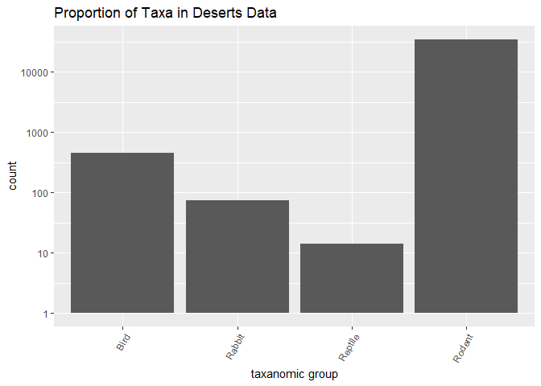
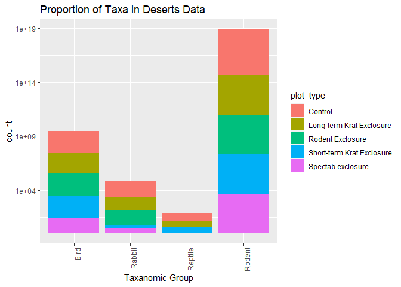
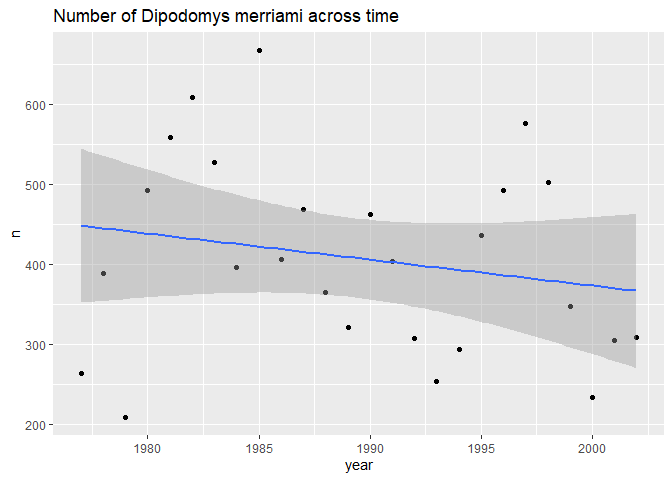
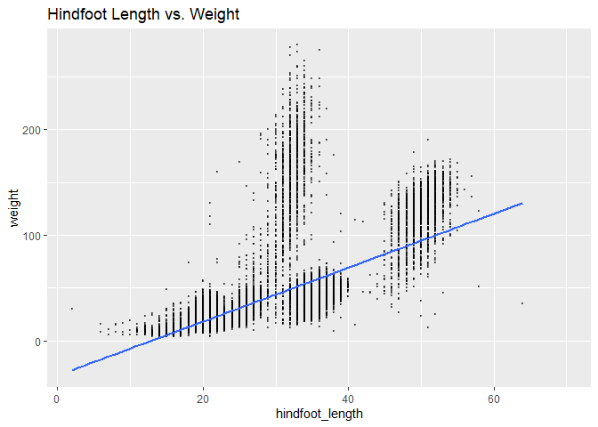
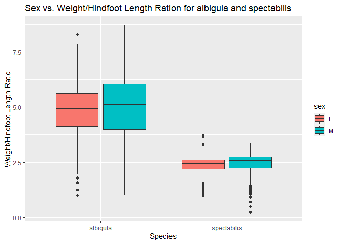

## Instructions
Answer the following questions and complete the exercises in RMarkdown. Please embed all of your code and push your final work to your repository. Your final lab report should be organized, clean, and run free from errors. Remember, you must remove the `#` for the included code chunks to run. Be sure to add your name to the author header above. For any included plots, make sure they are clearly labeled. You are free to use any plot type that you feel best communicates the results of your analysis.  

Make sure to use the formatting conventions of RMarkdown to make your report neat and clean!  

## Load the libraries

```r
library(tidyverse)
library(janitor)
library(here)
library(naniar)
```


## Desert Ecology
For this assignment, we are going to use a modified data set on [desert ecology](http://esapubs.org/archive/ecol/E090/118/). The data are from: S. K. Morgan Ernest, Thomas J. Valone, and James H. Brown. 2009. Long-term monitoring and experimental manipulation of a Chihuahuan Desert ecosystem near Portal, Arizona, USA. Ecology 90:1708.

```r
deserts <- read_csv(here("lab10", "data", "surveys_complete.csv"))
```

```
## 
## -- Column specification --------------------------------------------------------
## cols(
##   record_id = col_double(),
##   month = col_double(),
##   day = col_double(),
##   year = col_double(),
##   plot_id = col_double(),
##   species_id = col_character(),
##   sex = col_character(),
##   hindfoot_length = col_double(),
##   weight = col_double(),
##   genus = col_character(),
##   species = col_character(),
##   taxa = col_character(),
##   plot_type = col_character()
## )
```

1. Use the function(s) of your choice to get an idea of its structure, including how NA's are treated. Are the data tidy?  

```r
glimpse(deserts)
```

```
## Rows: 34,786
## Columns: 13
## $ record_id       <dbl> 1, 2, 3, 4, 5, 6, 7, 8, 9, 10, 11, 12, 13, 14, 15, ...
## $ month           <dbl> 7, 7, 7, 7, 7, 7, 7, 7, 7, 7, 7, 7, 7, 7, 7, 7, 7, ...
## $ day             <dbl> 16, 16, 16, 16, 16, 16, 16, 16, 16, 16, 16, 16, 16,...
## $ year            <dbl> 1977, 1977, 1977, 1977, 1977, 1977, 1977, 1977, 197...
## $ plot_id         <dbl> 2, 3, 2, 7, 3, 1, 2, 1, 1, 6, 5, 7, 3, 8, 6, 4, 3, ...
## $ species_id      <chr> "NL", "NL", "DM", "DM", "DM", "PF", "PE", "DM", "DM...
## $ sex             <chr> "M", "M", "F", "M", "M", "M", "F", "M", "F", "F", "...
## $ hindfoot_length <dbl> 32, 33, 37, 36, 35, 14, NA, 37, 34, 20, 53, 38, 35,...
## $ weight          <dbl> NA, NA, NA, NA, NA, NA, NA, NA, NA, NA, NA, NA, NA,...
## $ genus           <chr> "Neotoma", "Neotoma", "Dipodomys", "Dipodomys", "Di...
## $ species         <chr> "albigula", "albigula", "merriami", "merriami", "me...
## $ taxa            <chr> "Rodent", "Rodent", "Rodent", "Rodent", "Rodent", "...
## $ plot_type       <chr> "Control", "Long-term Krat Exclosure", "Control", "...
```


```r
naniar::miss_var_summary(deserts)
```

```
## # A tibble: 13 x 3
##    variable        n_miss pct_miss
##    <chr>            <int>    <dbl>
##  1 hindfoot_length   3348     9.62
##  2 weight            2503     7.20
##  3 sex               1748     5.03
##  4 record_id            0     0   
##  5 month                0     0   
##  6 day                  0     0   
##  7 year                 0     0   
##  8 plot_id              0     0   
##  9 species_id           0     0   
## 10 genus                0     0   
## 11 species              0     0   
## 12 taxa                 0     0   
## 13 plot_type            0     0
```
This data is not tidy

2. How many genera and species are represented in the data? What are the total number of observations? Which species is most/ least frequently sampled in the study?

```r
names(deserts)
```

```
##  [1] "record_id"       "month"           "day"             "year"           
##  [5] "plot_id"         "species_id"      "sex"             "hindfoot_length"
##  [9] "weight"          "genus"           "species"         "taxa"           
## [13] "plot_type"
```


```r
deserts %>%
  tabyl(genus) %>%
  arrange(desc(n)) %>%
  adorn_totals()
```

```
##             genus     n      percent
##         Dipodomys 16167 4.647559e-01
##       Chaetodipus  6029 1.733169e-01
##         Onychomys  3267 9.391709e-02
##   Reithrodontomys  2694 7.744495e-02
##        Peromyscus  2234 6.422124e-02
##       Perognathus  1629 4.682918e-02
##           Neotoma  1252 3.599149e-02
##  Ammospermophilus   437 1.256253e-02
##        Amphispiza   303 8.710401e-03
##      Spermophilus   249 7.158052e-03
##          Sigmodon   233 6.698097e-03
##        Sylvilagus    75 2.156040e-03
##            Pipilo    52 1.494854e-03
##   Campylorhynchus    50 1.437360e-03
##           Baiomys    46 1.322371e-03
##        Callipepla    16 4.599552e-04
##       Calamospiza    13 3.737136e-04
##            Rodent    10 2.874720e-04
##         Pooecetes     8 2.299776e-04
##        Sceloporus     6 1.724832e-04
##            Lizard     4 1.149888e-04
##           Sparrow     4 1.149888e-04
##        Ammodramus     2 5.749439e-05
##     Cnemidophorus     2 5.749439e-05
##          Crotalus     2 5.749439e-05
##       Zonotrichia     2 5.749439e-05
##             Total 34786 1.000000e+00
```


```r
deserts %>%
  summarize(distinct_genus=n_distinct(genus))
```

```
## # A tibble: 1 x 1
##   distinct_genus
##            <int>
## 1             26
```


```r
deserts %>%
  tabyl(species) %>%
  arrange(desc(n)) %>%
  adorn_totals()
```

```
##          species     n      percent
##         merriami 10596 3.046053e-01
##     penicillatus  3123 8.977750e-02
##            ordii  3027 8.701777e-02
##          baileyi  2891 8.310815e-02
##        megalotis  2609 7.500144e-02
##      spectabilis  2504 7.198298e-02
##         torridus  2249 6.465245e-02
##           flavus  1597 4.590927e-02
##         eremicus  1299 3.734261e-02
##         albigula  1252 3.599149e-02
##      leucogaster  1006 2.891968e-02
##      maniculatus   899 2.584373e-02
##          harrisi   437 1.256253e-02
##        bilineata   303 8.710401e-03
##        spilosoma   248 7.129305e-03
##         hispidus   179 5.145748e-03
##              sp.    86 2.472259e-03
##        audubonii    75 2.156040e-03
##       fulvescens    75 2.156040e-03
##  brunneicapillus    50 1.437360e-03
##          taylori    46 1.322371e-03
##      fulviventer    43 1.236129e-03
##     ochrognathus    43 1.236129e-03
##        chlorurus    39 1.121141e-03
##         leucopus    36 1.034899e-03
##         squamata    16 4.599552e-04
##      melanocorys    13 3.737136e-04
##      intermedius     9 2.587248e-04
##        gramineus     8 2.299776e-04
##         montanus     8 2.299776e-04
##           fuscus     5 1.437360e-04
##        undulatus     5 1.437360e-04
##       leucophrys     2 5.749439e-05
##       savannarum     2 5.749439e-05
##           clarki     1 2.874720e-05
##       scutalatus     1 2.874720e-05
##     tereticaudus     1 2.874720e-05
##           tigris     1 2.874720e-05
##        uniparens     1 2.874720e-05
##          viridis     1 2.874720e-05
##            Total 34786 1.000000e+00
```


```r
deserts %>%
  summarize(distinct_species=n_distinct(species))
```

```
## # A tibble: 1 x 1
##   distinct_species
##              <int>
## 1               40
```

3. What is the proportion of taxa included in this study? Show a table and plot that reflects this count.

```r
deserts %>% 
  ggplot(aes(x = taxa)) + geom_bar() + scale_y_log10()+
  theme(axis.text.x = element_text(angle = 60, hjust = 1)) +
  labs(title = "Proportion of Taxa in Deserts Data",
       x = "taxanomic group",
       fill="taxa")
```

<!-- -->

4. For the taxa included in the study, use the fill option to show the proportion of individuals sampled by `plot_type.`

```r
deserts %>% 
  ggplot(aes(x = taxa, fill = plot_type)) + geom_bar() + scale_y_log10()+
  theme(axis.text.x = element_text(angle = 90, hjust = 1)) +
  labs(title = "Proportion of Taxa in Deserts Data",
       x = "Taxanomic Group",
       fill = "plot_type")
```

<!-- -->

5. What is the range of weight for each species included in the study? Remove any observations of weight that are NA so they do not show up in the plot.

```r
deserts%>%
group_by(species)%>%
filter(weight!="NA")%>%
ggplot(aes(x = species, y = weight, color=species)) +
  geom_boxplot(na.rm=T)+coord_flip()+
labs(title = "Weight Measurements per Species",x="Species",y="Number of Weight Measurements")
```

<!-- -->

6. Add another layer to your answer from #4 using `geom_point` to get an idea of how many measurements were taken for each species.

```r
deserts%>%
group_by(species)%>%
filter(weight!="NA")%>%
ggplot(aes(x=species,y=weight, color=species))+
geom_boxplot(na.rm=T)+
geom_point(size=.5)+
theme(axis.text.x = element_text(angle = 60, hjust = 1))+
labs(title = "Weight Measurements per Species",x="Species",y="Number of Weight Measurements")
```

<!-- -->

7. [Dipodomys merriami](https://en.wikipedia.org/wiki/Merriam's_kangaroo_rat) is the most frequently sampled animal in the study. How have the number of observations of this species changed over the years included in the study?

```r
deserts %>%
  filter(genus=="Dipodomys", species=="merriami") %>%
  count(genus, species, year)
```

```
## # A tibble: 26 x 4
##    genus     species   year     n
##    <chr>     <chr>    <dbl> <int>
##  1 Dipodomys merriami  1977   264
##  2 Dipodomys merriami  1978   389
##  3 Dipodomys merriami  1979   209
##  4 Dipodomys merriami  1980   493
##  5 Dipodomys merriami  1981   559
##  6 Dipodomys merriami  1982   609
##  7 Dipodomys merriami  1983   528
##  8 Dipodomys merriami  1984   396
##  9 Dipodomys merriami  1985   667
## 10 Dipodomys merriami  1986   406
## # ... with 16 more rows
```

```r
deserts %>%
  filter(genus=="Dipodomys", species=="merriami") %>%
  count(genus, species, year) %>%
  ggplot(aes(x=year, y=n))+geom_point()+
  labs(title="Number of Dipodomys merriami across time", x="year", y="n")+geom_smooth(method="lm", na.rm=T)
```

```
## `geom_smooth()` using formula 'y ~ x'
```

<!-- -->

8. What is the relationship between `weight` and `hindfoot` length? Consider whether or not over plotting is an issue.

```r
deserts %>%
  ggplot(aes(x=hindfoot_length, y=weight))+geom_point(size=.25,alpha=.5, nar.rm=T)+labs(title="Hindfoot Length vs. Weight")+geom_smooth(method="lm", na.rm=T)
```

```
## Warning: Ignoring unknown parameters: nar.rm
```

```
## `geom_smooth()` using formula 'y ~ x'
```

```
## Warning: Removed 4048 rows containing missing values (geom_point).
```

<!-- -->

9. Which two species have, on average, the highest weight? Once you have identified them, make a new column that is a ratio of `weight` to `hindfoot_length`. Make a plot that shows the range of this new ratio and fill by sex.

```r
deserts %>%
  filter(weight!="NA") %>%
  group_by(species) %>%
  summarize(mean_wt=mean(weight, na.rm=T)) %>%
  arrange(desc(mean_wt))
```

```
## # A tibble: 22 x 2
##    species      mean_wt
##    <chr>          <dbl>
##  1 albigula       159. 
##  2 spectabilis    120. 
##  3 spilosoma       93.5
##  4 hispidus        65.6
##  5 fulviventer     58.9
##  6 ochrognathus    55.4
##  7 ordii           48.9
##  8 merriami        43.2
##  9 baileyi         31.7
## 10 leucogaster     31.6
## # ... with 12 more rows
```


```r
deserts %>%
  filter(species=="albigula" | species=="spectabilis") %>%
  mutate(ratio_w_hl=weight/hindfoot_length)
```

```
## # A tibble: 3,756 x 14
##    record_id month   day  year plot_id species_id sex   hindfoot_length weight
##        <dbl> <dbl> <dbl> <dbl>   <dbl> <chr>      <chr>           <dbl>  <dbl>
##  1         1     7    16  1977       2 NL         M                  32     NA
##  2         2     7    16  1977       3 NL         M                  33     NA
##  3        11     7    16  1977       5 DS         F                  53     NA
##  4        17     7    16  1977       3 DS         F                  48     NA
##  5        20     7    17  1977      11 DS         F                  48     NA
##  6        22     7    17  1977      15 NL         F                  31     NA
##  7        30     7    17  1977      10 DS         F                  52     NA
##  8        38     7    17  1977      17 NL         M                  33     NA
##  9        42     7    18  1977      18 DS         F                  46     NA
## 10        58     7    18  1977      12 DS         M                  45     NA
## # ... with 3,746 more rows, and 5 more variables: genus <chr>, species <chr>,
## #   taxa <chr>, plot_type <chr>, ratio_w_hl <dbl>
```

```r
deserts %>%
  filter(sex!="NA", weight!="NA", hindfoot_length!="NA") %>%
  filter(species=="albigula" | species=="spectabilis") %>%
  mutate(ratio_w_hl=weight/hindfoot_length) %>%
  ggplot(aes(x=species, y=ratio_w_hl, fill=sex))+geom_boxplot(nar.rm=T)+labs(title="Sex vs. Weight/Hindfoot Length Ration for albigula and spectabilis", x="Species", y="Weight/Hindfoot Length Ratio")
```

```
## Warning: Ignoring unknown parameters: nar.rm
```

<!-- -->

10. Make one plot of your choice! Make sure to include at least two of the aesthetics options you have learned.

```r
deserts %>%
  filter(sex!="NA") %>%
  ggplot(aes(x=species_id, fill=sex))+ geom_bar(position="dodge")+coord_flip()
```

<!-- -->

## Push your final code to GitHub!
Please be sure that you check the `keep md` file in the knit preferences. 
