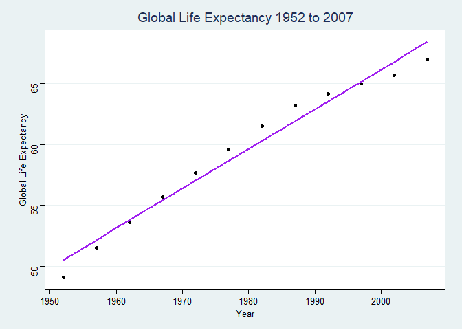
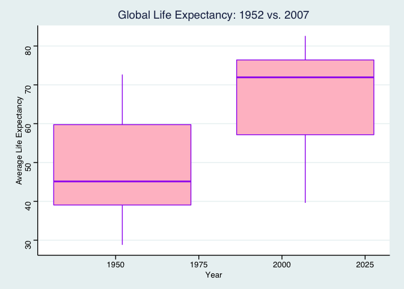
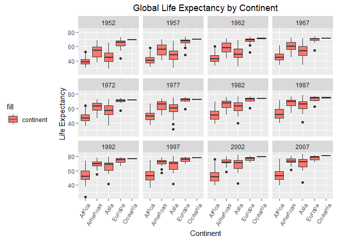
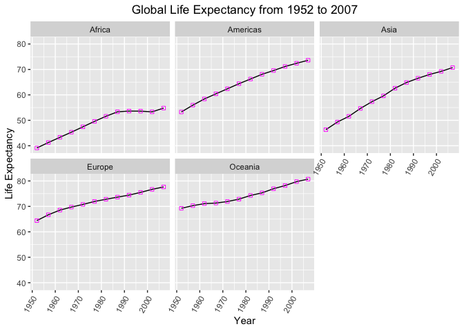
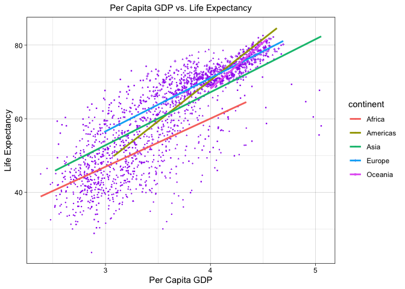
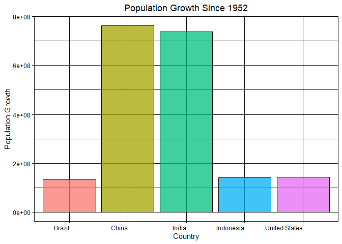
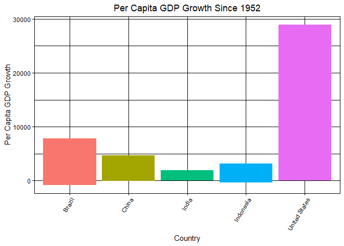
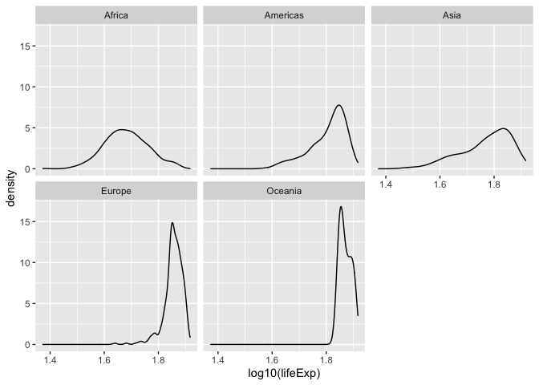

## Instructions
Answer the following questions and complete the exercises in RMarkdown. Please embed all of your code and push your final work to your repository. Your final lab report should be organized, clean, and run free from errors. Remember, you must remove the `#` for the included code chunks to run. Be sure to add your name to the author header above. For any included plots, make sure they are clearly labeled. You are free to use any plot type that you feel best communicates the results of your analysis.  

**In this homework, you should make use of the aesthetics you have learned. It's OK to be flashy!**

Make sure to use the formatting conventions of RMarkdown to make your report neat and clean!  

## Load the libraries

```r
library(tidyverse)
library(janitor)
library(here)
library(naniar)
```

## Resources
The idea for this assignment came from [Rebecca Barter's](http://www.rebeccabarter.com/blog/2017-11-17-ggplot2_tutorial/) ggplot tutorial so if you get stuck this is a good place to have a look.  

## Gapminder
For this assignment, we are going to use the dataset [gapminder](https://cran.r-project.org/web/packages/gapminder/index.html). Gapminder includes information about economics, population, and life expectancy from countries all over the world. You will need to install it before use. This is the same data that we will use for midterm 2 so this is good practice.

```r
#install.packages("gapminder")
library("gapminder")
```

## Questions
The questions below are open-ended and have many possible solutions. Your approach should, where appropriate, include numerical summaries and visuals. Be creative; assume you are building an analysis that you would ultimately present to an audience of stakeholders. Feel free to try out different `geoms` if they more clearly present your results.  

**1. Use the function(s) of your choice to get an idea of the overall structure of the data frame, including its dimensions, column names, variable classes, etc. As part of this, determine how NA's are treated in the data.**  

```r
glimpse(gapminder)
```

```
## Rows: 1,704
## Columns: 6
## $ country   <fct> Afghanistan, Afghanistan, Afghanistan, Afghanistan, Afghani…
## $ continent <fct> Asia, Asia, Asia, Asia, Asia, Asia, Asia, Asia, Asia, Asia,…
## $ year      <int> 1952, 1957, 1962, 1967, 1972, 1977, 1982, 1987, 1992, 1997,…
## $ lifeExp   <dbl> 28.801, 30.332, 31.997, 34.020, 36.088, 38.438, 39.854, 40.…
## $ pop       <int> 8425333, 9240934, 10267083, 11537966, 13079460, 14880372, 1…
## $ gdpPercap <dbl> 779.4453, 820.8530, 853.1007, 836.1971, 739.9811, 786.1134,…
```


```r
naniar::miss_var_summary(gapminder)
```

```
## # A tibble: 6 x 3
##   variable  n_miss pct_miss
##   <chr>      <int>    <dbl>
## 1 country        0        0
## 2 continent      0        0
## 3 year           0        0
## 4 lifeExp        0        0
## 5 pop            0        0
## 6 gdpPercap      0        0
```

**2. Among the interesting variables in gapminder is life expectancy. How has global life expectancy changed between 1952 and 2007?**

```r
names(gapminder)
```

```
## [1] "country"   "continent" "year"      "lifeExp"   "pop"       "gdpPercap"
```


```r
gapminder %>%
  group_by(year) %>%
  filter(between(year, 1952, 2007)) %>%
  summarize(mean_lifeExp=mean(lifeExp)) %>%
  arrange(year)
```

```
## `summarise()` ungrouping output (override with `.groups` argument)
```

```
## # A tibble: 12 x 2
##     year mean_lifeExp
##    <int>        <dbl>
##  1  1952         49.1
##  2  1957         51.5
##  3  1962         53.6
##  4  1967         55.7
##  5  1972         57.6
##  6  1977         59.6
##  7  1982         61.5
##  8  1987         63.2
##  9  1992         64.2
## 10  1997         65.0
## 11  2002         65.7
## 12  2007         67.0
```


```r
library(ggthemes)
```


```r
gapminder %>%
  group_by(year) %>%
  filter(between(year, 1952, 2007)) %>%
  summarize(mean_lifeExp=mean(lifeExp)) %>%
  ggplot(aes(x=year, y=mean_lifeExp)) +geom_point() + geom_smooth(method="lm", se=FALSE, color="purple")+
  theme_stata() +
  labs(title="Global Life Expectancy 1952 to 2007",
       x="Year", y="Global Life Expectancy")
```

```
## `summarise()` ungrouping output (override with `.groups` argument)
```

```
## `geom_smooth()` using formula 'y ~ x'
```

<!-- -->

**3. How do the distributions of life expectancy compare for the years 1952 and 2007?**

```r
gapminder %>%
  group_by(year) %>%
  filter(year==1952 | year==2007) %>%
  summarize(min_lifeExp=min(lifeExp),
            max_lifeExp=max(lifeExp),
            median_lifeExp=median(lifeExp))
```

```
## `summarise()` ungrouping output (override with `.groups` argument)
```

```
## # A tibble: 2 x 4
##    year min_lifeExp max_lifeExp median_lifeExp
##   <int>       <dbl>       <dbl>          <dbl>
## 1  1952        28.8        72.7           45.1
## 2  2007        39.6        82.6           71.9
```


```r
gapminder %>%
  group_by(year) %>%
  filter(year==1952 | year==2007) %>%
  ggplot(aes(group=year, x=year, y=lifeExp)) +geom_boxplot(fill="pink", color="purple") +
  theme_stata() +
  labs(title="Global Life Expectancy: 1952 vs. 2007",
       x="Year", y="Average Life Expectancy")
```

<!-- -->

**4. Your answer above doesn't tell the whole story since life expectancy varies by region. Make a summary that shows the min, mean, and max life expectancy by continent for all years represented in the data.**

```r
gapminder %>%
  group_by(continent, year) %>%
  summarize(min_lifeExp=min(lifeExp),
            max_lifeExp=max(lifeExp),
            median_lifeExp=median(lifeExp))
```

```
## `summarise()` regrouping output by 'continent' (override with `.groups` argument)
```

```
## # A tibble: 60 x 5
## # Groups:   continent [5]
##    continent  year min_lifeExp max_lifeExp median_lifeExp
##    <fct>     <int>       <dbl>       <dbl>          <dbl>
##  1 Africa     1952        30          52.7           38.8
##  2 Africa     1957        31.6        58.1           40.6
##  3 Africa     1962        32.8        60.2           42.6
##  4 Africa     1967        34.1        61.6           44.7
##  5 Africa     1972        35.4        64.3           47.0
##  6 Africa     1977        36.8        67.1           49.3
##  7 Africa     1982        38.4        69.9           50.8
##  8 Africa     1987        39.9        71.9           51.6
##  9 Africa     1992        23.6        73.6           52.4
## 10 Africa     1997        36.1        74.8           52.8
## # … with 50 more rows
```


```r
gapminder %>%
  group_by(continent, year) %>%
   ggplot(aes(group=continent, x=continent, y=lifeExp, fill="continent")) +geom_boxplot() + facet_wrap(~year)+
 theme(legend.position = "left",
       axis.text.x = element_text(angle=60, hjust=1), plot.title=element_text(hjust=.5))+
  labs(title="Global Life Expectancy by Continent",
       x="Continent", y="Life Expectancy")
```

<!-- -->

**5. How has life expectancy changed between 1952-2007 for each continent?**

```r
gapminder %>%
  group_by(continent, year) %>%
  filter(between(year, 1952, 2007)) %>%
  summarize(mean_lifeExp=mean(lifeExp))
```

```
## `summarise()` regrouping output by 'continent' (override with `.groups` argument)
```

```
## # A tibble: 60 x 3
## # Groups:   continent [5]
##    continent  year mean_lifeExp
##    <fct>     <int>        <dbl>
##  1 Africa     1952         39.1
##  2 Africa     1957         41.3
##  3 Africa     1962         43.3
##  4 Africa     1967         45.3
##  5 Africa     1972         47.5
##  6 Africa     1977         49.6
##  7 Africa     1982         51.6
##  8 Africa     1987         53.3
##  9 Africa     1992         53.6
## 10 Africa     1997         53.6
## # … with 50 more rows
```


```r
gapminder %>%
  group_by(continent, year) %>%
  filter(between(year, 1952, 2007)) %>%
  summarize(mean_lifeExp=mean(lifeExp)) %>%
  ggplot(aes(x=year, y=mean_lifeExp)) + geom_line() + geom_point(shape=0, color="magenta") + facet_wrap(~continent)+
 theme(legend.position = "left",
       axis.text.x = element_text(angle=60, hjust=1), plot.title=element_text(hjust=.5))+
  labs(title="Global Life Expectancy from 1952 to 2007",
       x="Year", y="Life Expectancy")
```

```
## `summarise()` regrouping output by 'continent' (override with `.groups` argument)
```

<!-- -->

**6. We are interested in the relationship between per capita GDP and life expectancy; i.e. does having more money help you live longer?**

```r
gapminder %>%
  select(gdpPercap, lifeExp) %>%
  arrange(gdpPercap)
```

```
## # A tibble: 1,704 x 2
##    gdpPercap lifeExp
##        <dbl>   <dbl>
##  1      241.    45.0
##  2      278.    46.5
##  3      299.    42.1
##  4      300.    32.5
##  5      312.    42.6
##  6      329.    35.9
##  7      331     36.3
##  8      336.    45.0
##  9      339.    39.0
## 10      344.    38.0
## # … with 1,694 more rows
```

```r
gapminder %>%
  ggplot(aes(x=log10(gdpPercap), y=lifeExp, color=continent, shape=continent)) + geom_point(color="purple", size=.5)+
  theme_linedraw()+
  theme(axis.text.x = element_text(hjust = .5))+
  theme(plot.title=element_text(size = rel(1), hjust=.5))+
  labs(title="Per Capita GDP vs. Life Expectancy",
       x="Per Capita GDP",
       y="Life Expectancy")+ geom_smooth(method="lm", se=FALSE)
```

```
## `geom_smooth()` using formula 'y ~ x'
```

<!-- -->

**7. Which countries have had the largest population growth since 1952?**

```r
gapminder %>%
  select(year, pop, country) %>%
  filter(year==1952|year==2007) %>%
  group_by(country) %>%
  summarize(total_pop_growth=diff(pop)) %>%
  arrange(desc(total_pop_growth))
```

```
## `summarise()` ungrouping output (override with `.groups` argument)
```

```
## # A tibble: 142 x 2
##    country       total_pop_growth
##    <fct>                    <int>
##  1 China                762419569
##  2 India                738396331
##  3 United States        143586947
##  4 Indonesia            141495000
##  5 Brazil               133408087
##  6 Pakistan             127924057
##  7 Bangladesh           103561480
##  8 Nigeria              101912068
##  9 Mexico                78556574
## 10 Philippines           68638596
## # … with 132 more rows
```

**8. Use your results from the question above to plot population growth for the top five countries since 1952.**

```r
gapminder %>%
  select(year, pop, country) %>%
  filter(year==1952|year==2007) %>%
  group_by(country) %>%
  summarize(total_pop_growth=diff(pop)) %>%
  arrange(desc(total_pop_growth)) %>%
  head(n=5) %>%
  ggplot(aes(x=country, y=total_pop_growth, fill=country)) +geom_col(position = "dodge", alpha=0.75, color="black") +
  theme_linedraw() +
  theme(plot.title=element_text(hjust=.5), axis.text.x = element_text( hjust=1), legend.position="none")+
  labs(title="Population Growth Since 1952",
       x="Country",
       y="Population Growth")
```

```
## `summarise()` ungrouping output (override with `.groups` argument)
```

<!-- -->

**9. How does per-capita GDP growth compare between these same five countries?**

```r
gapminder %>%
  filter(between(year, 1952, 2007)) %>%
  filter(country=="Brazil"|country=="China"|country=="India"|country=="Indonesia"|country=="United States") %>%
  group_by(country) %>%
  summarize(total_gdpPercap=sum(gdpPercap))
```

```
## `summarise()` ungrouping output (override with `.groups` argument)
```

```
## # A tibble: 5 x 2
##   country       total_gdpPercap
##   <fct>                   <dbl>
## 1 Brazil                 69952.
## 2 China                  17860.
## 3 India                  12688.
## 4 Indonesia              20896.
## 5 United States         315134.
```


```r
gapminder %>%
  filter(between(year, 1952, 2007)) %>%
  filter(country=="Brazil"|country=="China"|country=="India"|country=="Indonesia"|country=="United States") %>%
  group_by(country) %>%
  summarize(total_gdpPercap=diff(gdpPercap)) %>%
  ggplot(aes(x=country, y=total_gdpPercap, fill=country))+geom_col()+theme_linedraw()+
  theme(plot.title=element_text(hjust=.5), axis.text.x = element_text(angle=60, hjust=1), legend.position="none")+
  labs(title="Per Capita GDP Growth Since 1952",
       x="Country",
       y="Per Capita GDP Growth")
```

```
## `summarise()` regrouping output by 'country' (override with `.groups` argument)
```

<!-- -->

**10. Make one plot of your choice that uses faceting!**

```r
gapminder %>%
ggplot(aes(x=log10(lifeExp)))+geom_density()+facet_wrap(~continent)
```

<!-- -->

## Push your final code to GitHub!
Please be sure that you check the `keep md` file in the knit preferences. 
